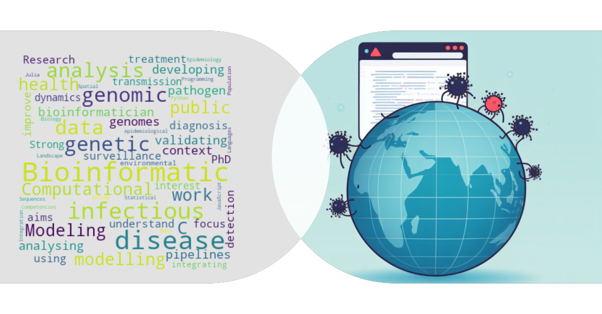

<!--
**himal2007/himal2007** is a ✨ _special_ ✨ repository because its `README.md` (this file) appears on your GitHub profile.

Here are some ideas to get you started:

- 🔭 I’m currently working on ...
- 🌱 I’m currently learning ...
- 👯 I’m looking to collaborate on ...
- 🤔 I’m looking for help with ...
- 💬 Ask me about ...
- 📫 How to reach me: ...
- 😄 Pronouns: ...
- ⚡ Fun fact: ...
-->

# Hi there! 👋 I'm Himal.

I am a bioinformatician at the [Peter Doherty Institute for Infection and Immunity](https://www.doherty.edu.au/), where I work on developing and validating bioinformatics pipelines for analysing pathogen genomes in the context of public health and surveillance. My work aims to improve the detection, diagnosis, and treatment of infectious diseases using genomic data.

## About Me

- 🎓 PhD in Bioinformatics from [Nematode and Vector Genomics Laboratory](https://nematodegenetics.wordpress.com/) at La Trobe University
- 🧬 Research focus: Bioinformatics and Modeling to understand transmission dynamics of infectious diseases
- 💡 Strong interest in integrating genomic, environmental, and epidemiological data
- 💻 Competencies: Bioinformatic analysis, Population genetics, Landscape genetics, Spatial modelling, Infectious disease modelling, Statistical analysis
- 😄 Pronouns: he/him
- 🔭 I’m currently working on developing bioinformatics pipelines for typing bacterial pathogens
- 🌱 I’m currently learning Nextflow
- 📖 I'm currently reading The Ultimate Hitchhiker's Guide to the Galaxy by Douglas Adams

<!-- ### Here’s some stats on my GitHub repos

*Courtesy of <https://github.com/anuraghazra/github-readme-stats>* -->